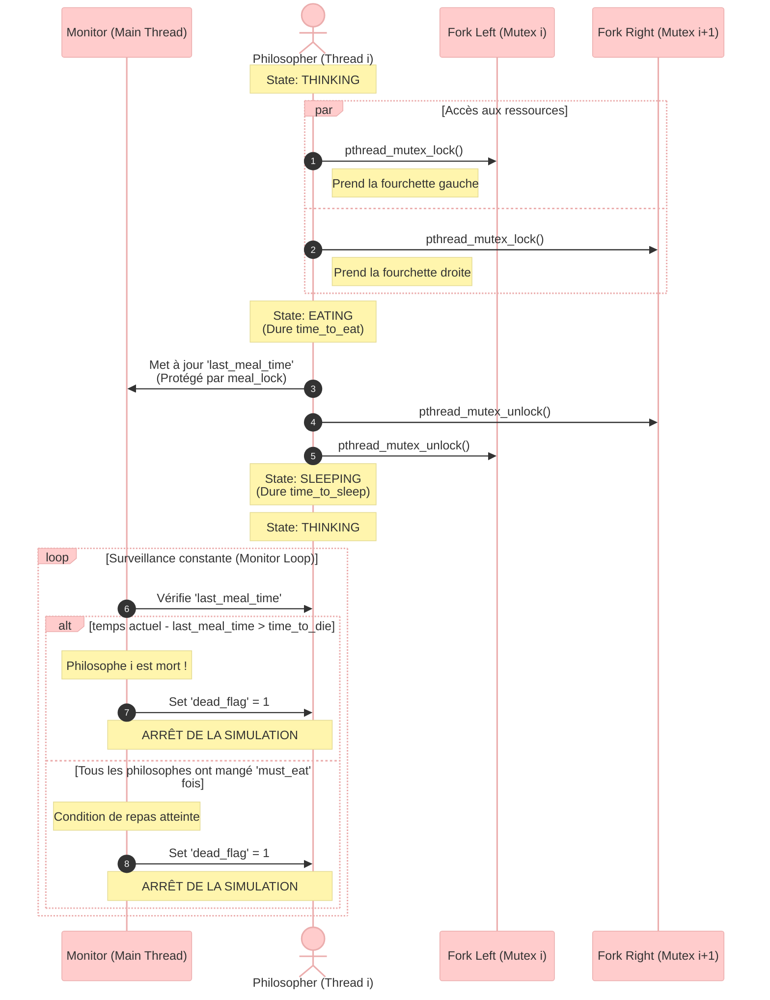

*This project has been created as part of the 42 curriculum by sdiakho (monana is my personal computer).*

## Description

The "Philosophers" project is an introduction to the basics of threading a process. It demonstrates how to work on the same memory space across multiple threads and highlights the complexities of concurrent programming. 

The core goal is to solve the classic "Dining Philosophers problem" using POSIX threads and mutexes. The simulation requires building a robust system architecture to prevent:
* **Data Races:** Protected shared variables (like meal times and state flags) using strict mutex locks.
* **Deadlocks:** Implemented a specific resource acquisition hierarchy (e.g., handling even/odd philosophers differently) to prevent infinite wait states.
* **Thread Starvation:** Dominated the CPU scheduler using micro-pauses to ensure fair access to resources (forks) for all threads.

## Instructions

### Compilation
A `Makefile` is provided at the root of the repository. It compiles the source files using `cc` with the `-Wall -Wextra -Werror` flags.
* To compile the mandatory part: `make`
* To remove object files: `make clean`
* To remove all generated files: `make fclean`
* To recompile entirely: `make re`

### Execution
Run the executable with the following arguments:
`./philo number_of_philosophers time_to_die time_to_eat time_to_sleep [number_of_times_each_philosopher_must_eat]`

* `number_of_philosophers`: The number of philosophers and also the number of forks.
* `time_to_die` (in milliseconds): If a philosopher didn't start eating `time_to_die` milliseconds since the beginning of their last meal or the beginning of the simulation, they die.
* `time_to_eat` (in milliseconds): The time it takes for a philosopher to eat. During that time, they will need to hold two forks.
* `time_to_sleep` (in milliseconds): The time a philosopher will spend sleeping.
* `number_of_times_each_philosopher_must_eat` (optional argument): If all philosophers have eaten at least this many times, the simulation stops. If not specified, the simulation stops when a philosopher dies.

### Testing
This project was strictly tested to ensure memory safety and thread synchronization:
* **Memory Leaks:** Tested with `valgrind --leak-check=full`.
* **Data Races:** Compiled and tested with the `-fsanitize=thread -g` flag to guarantee absolute thread safety.

**Usage Example:**
`./philo 5 800 200 200 7`

## Resources

* **Documentation:** POSIX Threads (`pthread`) standard documentation (`man pthreads`, `man pthread_mutex_init`).
* **System Architecture:** Research on CPU scheduling, context switching, and thread starvation.
* **AI Usage:** AI was used as a Socratic guide during the development process. It was specifically utilized to understand low-level hardware phenomena (like how the OS scheduler assigns CPU time and causes thread starvation) and to validate the logic of the IPC/Mutex architecture. No code was directly generated by AI; it served as an interactive theoretical sounding board to debug structural deadlocks.

## Architecture

The program relies on a strict separation between the execution threads and a central monitoring system to avoid deadlocks and ensure precise timing.

[Main Process]
   │
   ├─> [Thread 1: Philosopher] <───> (Mutex: Left Fork)
   ├─> [Thread 2: Philosopher] <───> (Mutex: Right Fork)
   ├─> ...
   │
   └─> [Monitor Loop (Check Death / Check Meals)]
         │
         └─> Reads shared variables protected by `meal_lock`.
         └─> Triggers `dead_flag` to safely stop all threads.
